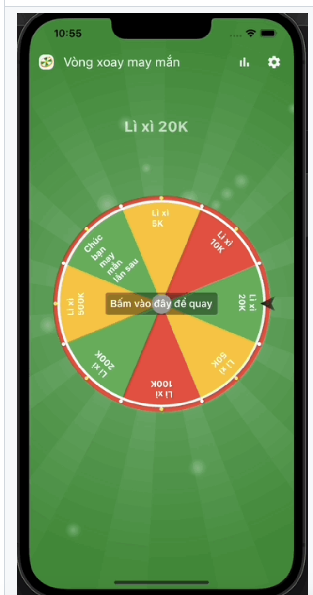

# flutter_fortune_wheel

Visualize (random) selection processes with widgets like a spinning wheel of fortune.

## Screenshot
<!--  -->
<table align="center" style="margin: 0px auto;">
  <tr>
    <td></img></td>
    <td></img></td>
  </tr>
</table>

## Demo

<table align="center" style="margin: 0px auto;">
  <tr>
    <th>Random Mode</th>
    <th>Priority Mode</th>
  </tr>
  <tr>
    <td></img></td>
    <td></img></td>
  </tr>
</table>

## Getting Started

This project is a starting point for a Flutter
[plug-in package](https://flutter.dev/developing-packages/),
a specialized package that includes platform-specific implementation code for
Android and/or iOS.

For help getting started with Flutter, view our
[online documentation](https://flutter.dev/docs), which offers tutorials,
samples, guidance on mobile development, and a full API reference.

